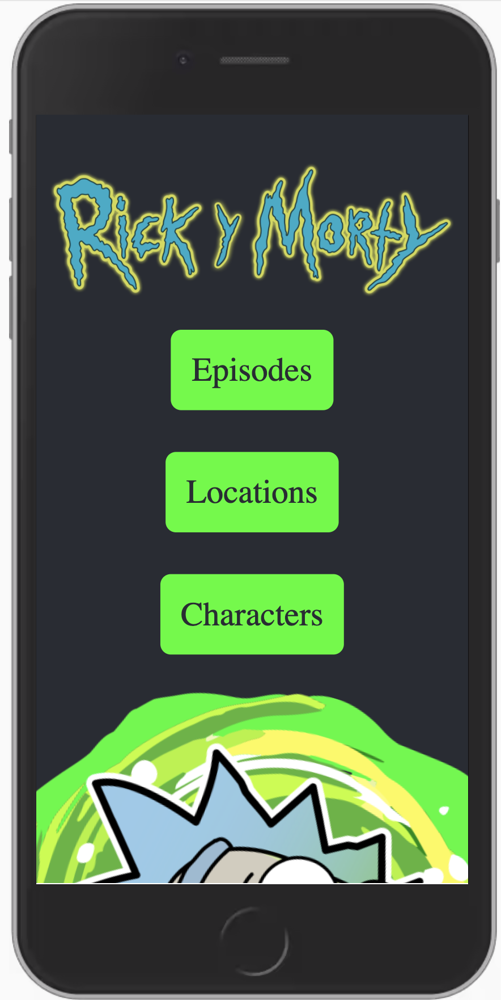

<!-- PROJECT SHIELDS -->
<!--
*** I'm using markdown "reference style" links for readability.
*** Reference links are enclosed in brackets [ ] instead of parentheses ( ).
*** See the bottom of this document for the declaration of the reference variables
*** for contributors-url, forks-url, etc. This is an optional, concise syntax you may use.
*** https://www.markdownguide.org/basic-syntax/#reference-style-links
-->
[](https://app.netlify.com/sites/jovial-shirley-b784c6/deploys)
[![Contributors][contributors-shield]][contributors-url]
[![Forks][forks-shield]][forks-url]
[![Stargazers][stars-shield]][stars-url]
[![Issues][issues-shield]][issues-url]
[![MIT License][license-shield]][license-url]
[![LinkedIn][linkedin-shield]][linkedin-url]


<!-- PROJECT LOGO -->
<br />
<p align="center">
  <a href="https://github.com/victorgreco/rick-and-morty-wiki">
    
  </a>

  <h3 align="center">Rick and Morty Wiki</h3>

  <p align="center">
    Wubba-lubba-dub-dub!
    <br />
    <a href="https://github.com/victorgreco/rick-and-morty-wiki"><strong>Explore the docs »</strong></a>
    <br />
    <br />
    <a href="https://github.com/victorgreco/rick-and-morty-wiki">View Demo</a>
    ·
    <a href="https://github.com/victorgreco/rick-and-morty-wiki/issues">Report Bug</a>
    ·
    <a href="https://github.com/victorgreco/rick-and-morty-wiki/issues">Request Feature</a>
  </p>
</p>

<!-- ABOUT THE PROJECT -->
## About The Project




### Built With

* []()
* []()
* []()


<!-- GETTING STARTED -->
## Getting Started

To get a local copy up and running follow these simple steps.

### Prerequisites

This is an example of how to list things you need to use the software and how to install them.
* npm
```sh
npm install npm@latest -g
```

### Installation

1. Clone the rick-and-morty-wiki
```sh
git clone https://github.com/victorgreco/rick-and-morty-wiki.git
```
2. Install NPM packages
```sh
npm install
```


<!-- USAGE EXAMPLES -->
## Usage

Use this space to show useful examples of how a project can be used. Additional screenshots, code examples and demos work well in this space. You may also link to more resources.

_For more examples, please refer to the [Documentation](https://example.com)_


<!-- ROADMAP -->
## Roadmap

See the [open issues](https://github.com/victorgreco/rick-and-morty-wiki/issues) for a list of proposed features (and known issues).


<!-- CONTRIBUTING -->
## Contributing

Contributions are what make the open source community such an amazing place to be learn, inspire, and create. Any contributions you make are **greatly appreciated**.

1. Fork the Project
2. Create your Feature Branch (`git checkout -b feature/AmazingFeature`)
3. Commit your Changes (`git commit -m 'Add some AmazingFeature'`)
4. Push to the Branch (`git push origin feature/AmazingFeature`)
5. Open a Pull Request


<!-- LICENSE -->
## License

Distributed under the MIT License. See `LICENSE` for more information.


<!-- CONTACT -->
## Contact

Victor Greco - [linkedin](https://www.linkedin.com/in/victor-greco/) - victorgreco263@gmail.com

Project Link: [https://github.com/victorgreco/rick-and-morty-wiki](https://github.com/victorgreco/rick-and-morty-wiki)


<!-- ACKNOWLEDGEMENTS -->
## Acknowledgements

* []()
* []()
* []()


<!-- MARKDOWN LINKS & IMAGES -->
<!-- https://www.markdownguide.org/basic-syntax/#reference-style-links -->
[contributors-shield]: https://img.shields.io/github/contributors/victorgreco/rick-and-morty-wiki.svg?style=flat-square
[contributors-url]: https://github.com/victorgreco/rick-and-morty-wiki/graphs/contributors
[forks-shield]: https://img.shields.io/github/forks/victorgreco/rick-and-morty-wiki.svg?style=flat-square
[forks-url]: https://github.com/victorgreco/rick-and-morty-wiki/network/members
[stars-shield]: https://img.shields.io/github/stars/victorgreco/rick-and-morty-wiki.svg?style=flat-square
[stars-url]: https://github.com/victorgreco/rick-and-morty-wiki/stargazers
[issues-shield]: https://img.shields.io/github/issues/victorgreco/rick-and-morty-wiki.svg?style=flat-square
[issues-url]: https://github.com/victorgreco/rick-and-morty-wiki/issues
[license-shield]: https://img.shields.io/github/license/victorgreco/rick-and-morty-wiki.svg?style=flat-square
[license-url]: https://github.com/victorgreco/rick-and-morty-wiki/blob/master/LICENSE.txt
[linkedin-shield]: https://img.shields.io/badge/-LinkedIn-black.svg?style=flat-square&logo=linkedin&colorB=555
[linkedin-url]: https://www.linkedin.com/in/victor-greco/
[product-screenshot]: images/screenshot.png
